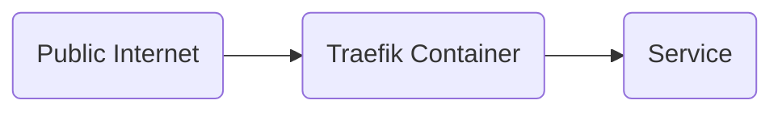

> Find a updated version of this guide in the [The Ultimate Guide to Setting Up Traefik](../ultimate-traefik-guide)
{: .prompt-tip }

These days, many applications are installed via containers. Traefik is a modern open-source reverse proxy and ingress controller that simplifies and secures service deployment.

The diagram below illustrates how Traefik routes traffic from the public internet to your containerized services, ensuring secure and efficient access:


In this guide, we’ll walk you through setting up Traefik and using Let’s Encrypt to secure your applications with SSL certificates.

## Setup Traefik with Docker

To run Traefik inside a Docker container using Docker Compose, start by creating the necessary directories and configuration files for Traefik. These files will set up Traefik’s environment and enable it to start smoothly. Once the structure is in place, Docker Compose will orchestrate the setup, allowing Traefik to handle routing and load balancing with ease.

Create the directory and `docker-compose.yml`

```bash
mkdir traefik
nano traefik/docker-compose.yml
```
Add the following configuration to the file:

```yaml
# Project URL: https://github.com/traefik/traefik
# Docs URL: https://doc.traefik.io/traefik/
services:
  traefik:
    image: traefik
    container_name: traefik
    restart: unless-stopped
    security_opt:
      - no-new-privileges:true
    environment:
      - TZ=Europe/Amsterdam # Change this to your timezone
    networks:
      - frontend
    ports:
      - 80:80 # HTTP entryPoints
      - 443:443 # HTTPS entryPoints
      - 8080:8080 # Dashbaord WebGui 
    volumes:
      - /var/run/docker.sock:/var/run/docker.sock:ro # Docker socket to watch for Traefik
      - ./traefik.yml:/traefik.yml:ro # Traefik config file
      - traefik:/certs # Docker volume to store the acme file for the Certifactes

volumes:
  traefik:
    name: traefik

networks:
  frontend:
    name: frontend
```
{: file='docker-compose.yml'}

## Traefik configuration

Let’s create a `traefik.yml` file, which will hold Traefik’s configuration settings. This file will define essential settings, such as entry points, providers, and middleware, allowing Traefik to handle traffic routing, load balancing, and security.

```bash
nano traefik/traefik.yml
```
Add the following configuration to the file:
```yaml
api:
  dashboard: true
  insecure: true
  debug: false
entryPoints:
  web:
    address: ":80"
    http:
      redirections:
        entryPoint:
          to: websecure
          scheme: https
  websecure:
    address: ":443"
serversTransport:
  insecureSkipVerify: true
providers:
  docker:
    endpoint: "unix:///var/run/docker.sock"
    exposedByDefault: false
    network: frontend
certificatesResolvers:
  letencrypt:
    acme:
      email: youremail@email.com
      storage: /certs/acme.json
      # caServer: https://acme-v02.api.letsencrypt.org/directory # prod (default)
      caServer: https://acme-staging-v02.api.letsencrypt.org/directory # staging
      httpChallenge:
        entryPoint: web
```
{: file='traefik.yml'}

## Start Traefik

Run the command below to start the container.

```bash
docker compose -f traefik/docker-compose.yml up -d
```

Then you can access the dashboard at http://serverip:8080.


## Add service

To verify Traefik is working correctly, we’ll set up a simple service using Traefik’s whoami application. This service provides basic HTTP responses displaying browser and OS information, which makes it ideal for testing.

Make a new directory called whoami to organize the service files.

```bash
mkdir whoami
nano whoami/docker-compose.yml
```

In the whoami directory, create a `docker-compose.yml` file with the following configuration:

```yaml
services:
  whoami:
    container_name: simple-service
    image: traefik/whoami
    labels:
        - "traefik.enable=true"
        - "traefik.http.routers.whoami.rule=Host(`test.example.com`)"
        - "traefik.http.routers.whoami.entrypoints=websecure"
        - "traefik.http.routers.whoami.tls=true"
        - "traefik.http.routers.whoami.tls.certresolver=letencrypt"
        - "traefik.http.services.whoami.loadbalancer.server.port=80"
    networks:
        - proxy
networks:
  proxy:
    name: proxy
```
{: file='docker-compose.yml'}

### Setting Up DNS and Starting the Service

Update your domain’s DNS settings at your provider to point test.example.com (replace test.example.com with your actual domain) to your server’s IP address. Ensure the DNS changes have propagated by verifying the domain resolves correctly to your IP address. You can use tools like nslookup or online DNS checkers for confirmation.

```bash
docker compose -f whoami/docker-compose.yml up -d
```

## Production Certificates

To switch Traefik to use the production Let’s Encrypt server for trusted SSL certificates, follow these steps:

Stop the running Traefik container to ensure no conflicts while clearing certificates:

```bash
docker compose -f traefik/docker-compose.yml down
```

Open your `traefik.yml` file and modify the caServer setting to point to the production Let’s Encrypt server. Comment out the staging line and ensure the production line is active, as shown below:

```yaml
...
certificatesResolvers:
  letencrypt:
    acme:
      email: youremail@email.com
      storage: /certs/acme.json
      caServer: https://acme-v02.api.letsencrypt.org/directory # prod (default)
      # caServer: https://acme-staging-v02.api.letsencrypt.org/directory # staging
      httpChallenge:
        entryPoint: web
...
```
{: file='traefik.yml'}

Remove the Docker volume where Traefik stores SSL certificates (acme.json) to clear the staging certificates:

Run:

```bash
docker volume rm traefik
```

After updating the configuration and clearing the staging certificates, restart Traefik to request production certificates.

```bash
docker compose -f traefik/docker-compose.yml up -d
```

You can use the same test service we made before the check if you now get the trusted certificates.

> Note: some browsers keep a hold on the previous served certificates for some time. If you still get the staging certificate, try another browser or incognito window


## Clean up
Great! Now that everything is confirmed working in production, you can clean up by removing the test whoami service. Follow these steps:

Stop and Remove the Whoami Service: Run the following command in the whoami directory to stop and remove the whoami container:
```bash
docker compose -f whoami/docker-compose.yml down
```
Remove the whoami directory and its contents:
```bash
sudo rm -rf whoami
```

This will clean up the test setup, leaving only the necessary configuration and services for your production environment.

## Conclusion
With Traefik set up as a reverse proxy, we now have a robust and secure solution in front of our applications. Traefik efficiently routes traffic, automatically secures connections with SSL certificates, and allows each application to be accessible through its own domain name. This setup provides a scalable, production-ready environment that simplifies traffic management and enhances security for all services.
