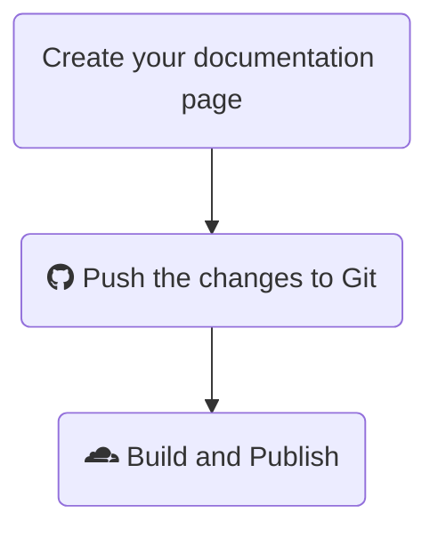

Material for MkDocs is a responsive, modern, and highly customizable theme that elevates the look and functionality of your MkDocs documentation site. Paired with Cloudflare Pages, it offers a fast, secure, and reliable hosting solution optimized for performance and scalability.

In this guide, we’ll walk through installing and configuring Material for MkDocs. We’ll set up the site, create pages using Markdown, and deploy it for free on Cloudflare Pages.

## Github

To kickstart your mkdocs deployment you can use the template I created, by following the steps below.

1.	Go to my [mkdocs-material-starter](https://github.com/svenvg93/mkdocs-material-starter) repository.
2.	Click on **Use this template** at the top of the repository page.
3.	Select **Create a new repository** from the dropdown.
4.	Give your new repository a unique name and click Create repository to finish.

This will create a copy of the template in your GitHub account, ready for customization!

## Set Up Cloudflare Pages

Once you’ve prepared the repository, it’s time to deploy your site on Cloudflare Pages. Here’s how:

1.	Visit [Cloudflare Dashboard](https://dash.cloudflare.com/).
2.	Go to **Workers & Pages**.
3.	Click on **Create** and navigate to Pages.
4.	Select **Connect to Git** and, if prompted, link your GitHub account.
5.	Choose the new repository you created from the template and click **Begin Setup**.
6.	In the build settings, select **MkDocs** as the framework preset.
7.	Click Save and Deploy.

Cloudflare will now clone your GitHub repository, build your MkDocs site, and publish it.

Once the deployment succeeds, click **Continue Project**. Cloudflare assigns a domain to your site, like mkdocs-em9.pages.dev.

> - The free plan allows up to 500 builds per month.
> - DNS propagation may take a few minutes, so be patient as your site becomes accessible.

### Custom Domain

As we want the website to use your domain name we will link it to the name.

*   Click **Custom Domain**
*   Go to **Set up a Custom Domain**
*   Enter the name click **continue**
*   Check the information and click **Activate Domain**

It will create a **CNAME** DNS record for your name to the generate name earlier.

## Set up the Site

Great! Now that your site is live, let’s start by adding some content to make it look complete.

### Clone repository

First, clone the repository you created from the template:

```bash
git clone git@<YOUR-USER-NAME>/<YOUR-REPO-NAME>.git
cd YOUR-REPO-NAME
```

### Adjust information

Open the `mkdocs.yml` file to adjust the the **site_name**.

```bash
nano mkdocs.yml
```

```yaml
site_name: My Docs

theme:
  name: material
```
{: file='mkdocs.yml'}

### Create Your First Page

Navigate to the docs folder and create a new markdown file:

```bash
cd docs
nane firstguide.md
```

In this file, add a title and some content:

```markdown
---
title: Lorem ipsum dolor sit amet 
---
# Welcome to the first page
Lorem ipsum dolor sit amet
```

Material for MkDocs offers a wide range of layout and customization options for your pages. You can explore the [Material for MkDocs Reference Guide]https://squidfunk.github.io/mkdocs-material/reference/ for additional styling and layout options.

### Publish post

Since your site’s content is managed in a GitHub repository, Cloudflare automatically monitors it for changes. Each commit or merge triggers a rebuild and republish of the website.



To publish a new post, just run these commands in your repository:

```bash
git add .
git commit -m "First Post"
git push
```

Cloudflare will detect the changes, rebuild your site, and publish the latest version. You can track the progress under Deployments in Cloudflare Workers & Pages.

## Preview build

Material for MkDocs offers extensive configuration options, and sometimes you might want to test changes before they’re visible to everyone. Cloudflare Pages supports Preview builds, which are created for branches in your GitHub repository other than the main branch.

### Make Branch in Github

1.	Open your GitHub repository.
2.	Go to **Branches**.
3.	Click on **New Branch**
4.	Name the branch, for example, test.

### Enable Preview Builds in Cloudflare Pages

In your Cloudflare Pages deployment;

1.	In your Cloudflare Pages deployment, go to **Settings**.
2.	Navigate to **Build & Deployments**.
3.	Select **Configure Preview Deployments**.
4.	Choose Custom branches.
5.	Under Include Preview branches, add the branch name you created (e.g., test).
6.	Click Save.

Now, Cloudflare Pages will build your MkDocs site based on the test branch. If you’re satisfied with the changes, you can create a pull request to merge them into the main branch for everyone to see.

Congrats! You’ve now set up and published documentation using Material for MkDocs and Cloudflare Pages.