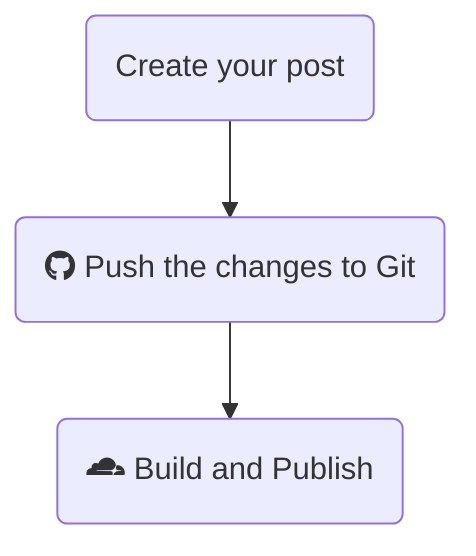

Jekyll is a versatile static site generator that turns plain text into beautifully designed static websites and blogs. It’s perfect for documentation sites, blogs, event sites, or any type of website you need. With Jekyll, you get a fast, secure, easy-to-use, and open-source tool for building static sites.

In this guide, we’ll walk through installing and configuring Jekyll with the Chirpy theme. We’ll set up the site, create some pages using Markdown, and even host it for free using Cloudflare Pages.

## Github

To get started with the Chirpy theme for Jekyll, follow these steps to set up and deploy your site on Cloudflare Pages:

### Use the Chirpy Template

1.	Go to the [Chirpy Template](https://github.com/cotes2020/chirpy-starter).
2.	Click Use this template and Create a new repository.
3.	Give the repository a name and click Create repository.


## Set Up Cloudflare Pages


Once you’ve prepared the repository, it’s time to deploy your site on Cloudflare Pages. Here’s how:

1.	Visit [Cloudflare Dashboard](https://dash.cloudflare.com/).
2.	Go to **Workers & Pages**.
3.	Click on **Create** and navigate to Pages.
4.	Select **Connect to Git** and, if prompted, link your GitHub account.
5.	Choose the new repository you created from the template and click Begin Setup.
6.	In the build settings, select **Jekyll** as the framework preset.

### Configure Build Settings

*   name: **BUNDLE_WITHOUT**
*   value: **""**
*   Click save and deploy

Cloudflare will now clone your GitHub repository, build the site, and publish it. Once done, you’ll see a generated domain like your-site-name.pages.dev.

> - You can build up to 500 times per month on the Free plan
> - It might take a few minutes before the dns works.

### Custom Domain

As we want the website to use your domain name we will link it to the name.

*   Click Custom Domain
*   Go to **Set up a Custom Domain**
*   Enter the name click **continue**
*   Check the information and click **Activate Domain**

It will create a **CNAME** DNS record for your name to the generate name earlier.

## Set up the Blog

Now have it all up and running, we will need to fill it with content. Looks a bit empty now.

### Clone repository

To start adding content to your blog, first, clone your newly created GitHub repository to your local machine.

```bash
git clone git@<YOUR-USER-NAME>/<YOUR-REPO-NAME>.git
cd YOUR-REPO-NAME
```

### Adjust information

Open the `_config.yml` file to customize essential site information, such as the title and description.

```
nano _config.yml
```

- **title** - Title of the Website
- **tagline** - Line to be shown under the name
- **timezone** - Change it to your timezone
- **avatar** - Location for your logo, it must be in /assests/path/you/want
- **name** - This will be the name shown as author with your articles

## Creating a New Blog Post in Jekyll

To create a new blog post in your Jekyll site, follow these steps:

### Navigate to the _posts Directory

Ensure you are in the root directory of your cloned repository. Then, navigate to the _posts directory:
```bash
cd _posts
```

### Create Your Blog Post File

Create a new Markdown file for your blog post using the naming convention YEAR-MONTH-DAY-title.md. For example, to create a post titled “First Post” on June 18, 2024:
```bash
nano 2024-06-18-first-post.md
```

### Add Front Matter and Content

At the top of your new Markdown file, include the front matter and content for your post. Here’s a simple example:

```markdown
---
layout: post
title:  "Welcome to Jekyll!"
---
# Welcome
**Hello world**, this is my first Jekyll blog post.
I hope you like it!
```
After entering your content, save the file and exit the text editor. If you are using nano, you can do this by pressing CTRL + X, then Y, and finally Enter.

### Preview Your Post Locally (Optional)

If you want to preview your changes locally before pushing them to GitHub, you can run:
```bash
bundle exec jekyll serve
```
Visit http://localhost:4000 in your web browser to see your new post.


## Commit and Push Your Changes

Once you are satisfied with your new blog post, add, commit, and push your changes:



All you need to do this run these commands

```
git add .
git commit -m "First Post"
git push
```

After pushing your changes, Cloudflare will automatically rebuild and deploy your site. Check your Cloudflare Pages project to see your new blog post live!

## Preview build

When working on your blog, you might want to experiment with new features or content before it goes live. Cloudflare Pages offers a feature called Preview Builds, which allows you to create builds for branches other than the main branch of your GitHub repository. This is especially useful for testing changes without affecting the live site.

### Make Branch in Github

1.	Open your GitHub repository.
2.	Go to **Branches**.
3.	Click on **New Branch**
4.	Name the branch, for example, test.

### Enable Preview Builds in Cloudflare Pages

In your Cloudflare Pages deployment;

1.	In your Cloudflare Pages deployment, go to **Settings**.
2.	Navigate to **Build & Deployments**.
3.	Select **Configure Preview Deployments**.
4.	Choose Custom branches.
5.	Under Include Preview branches, add the branch name you created (e.g., test).
6.	Click Save.

Now that Cloudflare Pages is set up to build your blog from the test branch, you can easily experiment with changes. If you’re happy with the updates made in the test branch, you can create a pull request to merge them into the main branch, making your new content accessible to everyone.

Congratulations! You’ve successfully built and published your blog using Jekyll and Cloudflare Pages! Enjoy sharing your content with the world!