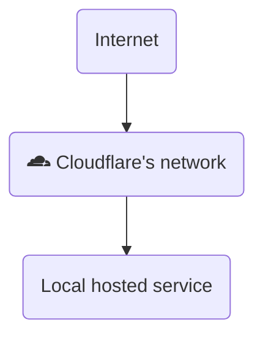

In the world of self-hosting, secure and reliable server access is crucial. Cloudflare Zero Trust offers a solution through Cloudflare Tunnels, allowing secure access to self-hosted services without opening ports or changing firewall settings. By creating an outbound-only connection to Cloudflare, traffic remains encrypted and routed through its global network, enhancing security and performance while protecting your server from direct attacks.



## Create Cloudflare Tunnel

### Docker compose

To get started, we need to set up a directory to store our `docker-compose.yml` file.

```
mkdir cloudflared
cd cloudflared
```
Next, create a `docker-compose.yml` file within this directory to define the necessary services for the Cloudflare Tunnel.
```bash
nano docker-compose.yml
```
Add the following configuration to the file:
```yaml
services:
  cloudflared:
    image: cloudflare/cloudflared
    container_name: cloudflared
    environment:
      - TZ=Europe/Amsterdam
      - TUNNEL_TOKEN=${TOKEN}
    restart: unless-stopped
    command: tunnel --no-autoupdate run
    networks:
      - cloudflared
networks:
  cloudflared:
    name: cloudflared
```
{: file='docker-compose.yml'}

### Obtain Your Tunnel Token

Before we can run the tunnel, you need to create a Tunnel in your Cloudflare account. Follow these steps:

To do so:

*   Go to [Cloudflare Dashboard](https://dash.cloudflare.com/)
*   Go to **Zero Trust**
*   Click **Networks** -> **Tunnels**
*   Click on **Add a Tunnel**
*   Select **Cloudflared** and click **Next**
*   Give your tunnel name
*   Click **Save Tunnel**
*   Choose for **Docker** as the installation
*   Copy the command with the copy button
*   Paste this in a notepad of your liking

To keep your token secure, create a `.env` file in the same directory as your `docker-compose.yml`:

```
nano .env
```

In the `.env` file, add the following content:

```
TOKEN=<Your tunnel token>
```

>Make sure to replace <Your tunnel token> with the lengthy string of characters found after --token in the command you copied from the Cloudflare website.

Once everything is configured, you can start the tunnel by running:

```
docker compose up -d
```

If everything is correct you will see your tunnel connected within a couple of seconds.

## Add a service

To verify that everything is functioning correctly, let’s start a simple service to test the tunnel using the [whoami application](https://github.com/traefik/whoami). This is a basic HTTP service that displays information about the browser and operating system.

First, create a new directory called whoami and add a `docker-compose.yml` file:

```bash
cd ..
mkdir whoami
nano whoami/docker-compose.yml
```
Add the following configuration to the file:
```yaml
services:
  whoami:
    container_name: simple-service
    image: traefik/whoami
    networks:
        - cloudflared
networks:
  cloudflared:
    name: cloudflared
```

Run the command below to start the container.

```bash
docker compose -f whoami/docker-compose.yml up -d
```

Now that the whoami service is running, we can continue with the tunnel setup. Go back to the Cloudflare dashboard and click Next.

Fill in the following fields:

- Subdomain: Enter the subdomain you want to use (e.g., test).
- Domain: Select the domain name from the list.
- Type: Choose HTTP.
- URL: Enter the IP address and port of the application you want to connect.

> If the application is on the same docker network as the cloudflare tunnel you can use the container name.

Finally, click **Save Tunnel**. This will configure the tunnel, allowing you to access your service via Cloudflare.

If you perform an nslookup and traceroute for the specified domain name, you’ll notice that all traffic is routed through Cloudflare, and your own IP address will not be visible. This demonstrates that the Cloudflare Tunnel effectively masks your server’s true IP, enhancing your security by protecting it from direct exposure to the internet.